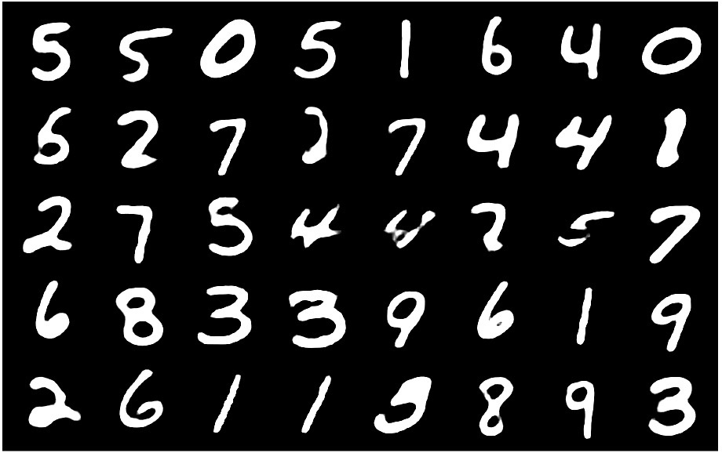
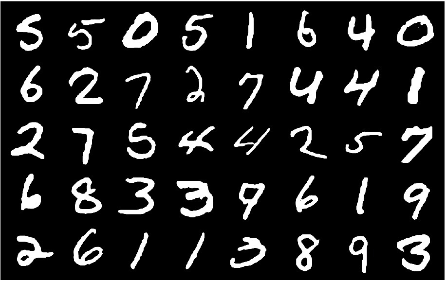

# VAE-Pytorch
An implementation of variational auto-encoder by pytorch

The following pictures are the generated result by fully connected neural network and the corresponding ground truth.(mannually labeled)

